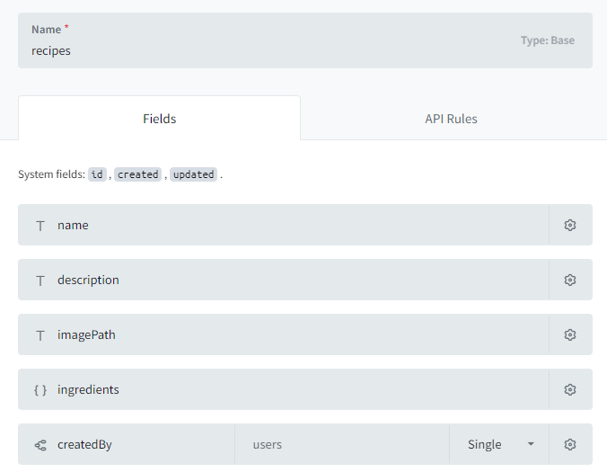
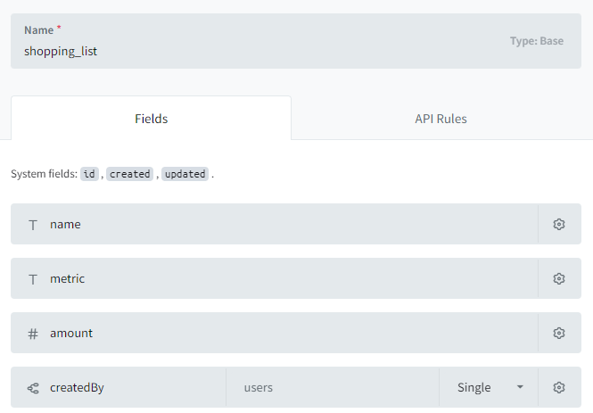

# Project

Diese Projekt wurde mit [Angular CLI](https://github.com/angular/angular-cli) version 17.2.1 entwickelt.
Als Backend wird [PocketBase](https://pocketbase.io/) verwendet.

## Vor der Ausführung

Vor der Ausführung muss das Backend entsprechend Konfiguriert werden. Das Backend benötigt für diese Anwendung 2 Collections ohne Zugriffsbeschränkung.

## Ausführen

1. Pocketbase mit `pocketbase serve` starten
2. Angular Projekt bauen und dev server starten `ng serve`